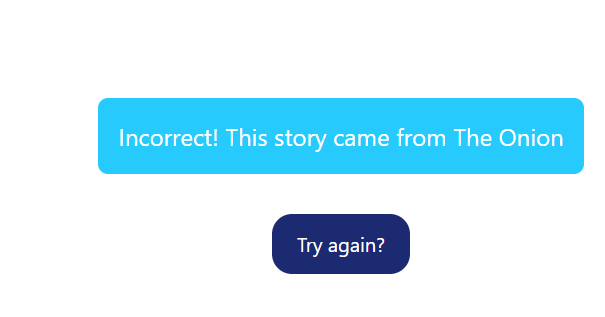

# Reality Check - Separating Fact from Fiction

**Reality Check** is a game that tests your skills in deciphering real news stories from fake clickbait headlines.

## Link to Site
[Reality Check](#)

## Instructions
Reality Check is simple and easy to play. Click the link and hit the start button to begin the quiz. Play as many times as you like—it's never-ending fun!

## Purpose of this Game
We created this web application during our HackSprint project in trimester 2 at Atlas School. Inspired by a New York Times article that challenged readers to differentiate between real images and AI-generated ones, we decided to create Reality Check.

## In Retrospect
The project deadline was only a week. We encountered several challenges but managed to get the web application running in this basic form. If we had more time, features we would have included are:

- Pulling data from Firestore and CloudRun instead of a JSON file.
- Enhancing the user experience by asking more prompts consecutively, adding a score tracker, and implementing a leaderboard.
- Making the game more challenging by using an API or LLM to generate more believable news stories.

## Authors
- Jessica Dison - [GitHub](https://github.com/jessasesh)
- Ryan Donaldson - [GitHub](https://github.com/donaldrs01)
- Luke Schula - [GitHub](https://github.com/lukeschula) [Linedin](https://www.linkedin.com/in/luke-schula-480548169/)

---

## Development Story

The journey of developing **Reality Check** began during our HackSprint project in trimester 2 at Atlas School. Tasked with the theme of "Reality," we drew inspiration from a New York Times article that challenged readers to discern between real and AI-generated images. This sparked the idea for a game that tests players' abilities to identify real news stories versus fake clickbait headlines.

### Initial Concept and Planning
In the brainstorming phase, we outlined the core mechanics: a simple quiz format where players would click on either a true or false story. We aimed for a clean, user-friendly interface to ensure an engaging experience. The project deadline was tight—only a week—so we prioritized essential features to get a functional version up and running quickly.

## Implemented Features
1. **Story Fetching**:
   - Implemented a function to load stories from a JSON file, allowing for easy data management.

2. **User Interface**:
   - Designed a simple UI with containers for true and false stories, along with a start button and feedback messages.

3. **Game Logic**:
   - Developed the logic to separate true and false stories and randomly display them for user selection.

4. **Feedback Mechanism**:
   - Provided instant feedback on user selections, indicating whether their choice was correct or incorrect.

5. **Replay Option**:
   - Included a "Try Again" button to allow users to restart the game easily.

## Features Still to Implement
1. **Dynamic Data Source**:
   - Transition from a static JSON file to a more dynamic solution using Firestore and CloudRun.

2. **Scoring System**:
   - Implement a scoring mechanism to track correct answers and display a total score at the end of each round.

3. **Leaderboard**:
   - Create a leaderboard feature to record high scores, fostering a competitive spirit among players.

4. **Enhanced User Experience**:
   - Add more prompts, animations, and design enhancements to make the game visually appealing.

5. **Challenge Mode**:
   - Introduce a timed challenge mode where players must answer within a set time limit.

## Challenges Encountered
The development process was not without its hurdles:

1. **Time Constraints**:
   - With only a week to complete the project, prioritizing features was crucial. We had to be strategic about what to implement initially.

2. **Data Management**:
   - Fetching and managing data from the JSON file posed challenges, particularly ensuring that the data was formatted correctly and handled gracefully in the event of errors.

3. **User Experience**:
   - Balancing simplicity with engagement was difficult. We wanted the game to be easy to understand but also captivating enough to encourage repeated play.

4. **Event Handling**:
   - Managing multiple event listeners and ensuring the correct functionality with user clicks required careful attention to detail, especially in maintaining clean and readable code.

5. **Debugging**:
   - As with any project, we encountered bugs and issues during testing. Troubleshooting these effectively was essential to ensure a smooth user experience.

---

## Conclusion
Overall, developing **Reality Check** was a rewarding experience that taught us a lot about teamwork, project management, and the intricacies of web development. While we successfully implemented the core features, there's plenty of room for growth and improvement. With plans to enhance the game further, we’re excited about the future of **Reality Check** and its potential impact on players' understanding of real versus fake news.
